<picture>
  <source media="(prefers-color-scheme: dark)" srcset="assets/hero-dark.svg">
  
</picture>

Sou engenheiro full-stack e trabalho do schema ao deploy. Desde 2018 construo SaaS multi-tenant que empresas usam todo dia para vender, cobrar e operar: loteadoras, produtoras de eventos, bares e restaurantes, plataformas de investimento.

Hoje sou responsável pelos produtos da **IB System**, e mantenho alguns produtos próprios em paralelo.

### Em produção

| Produto | O que faz | Stack |
|---|---|---|
| **Lotemobile** | Gestão de loteamentos: contratos, boletos, assinatura eletrônica e atendimento por WhatsApp | Laravel, React, MariaDB, AWS ECS |
| **IB Ticket** | Venda e validação de ingressos para várias organizações, com checkout PIX e cartão | Laravel, React, Expo, MySQL |
| **IbPag** | Pagamento pré-pago por NFC em eventos, PDV e comandas, rodando em maquininha Android | Fastify, Drizzle, Kotlin, Compose |
| **HRT Invest** | Plataforma de investimento em debêntures tokenizadas, com contratos digitais | Laravel, Next.js, Expo |
| **MandaPedir** | Sistema para bar e restaurante: PDV, comandas, delivery e pedido na mesa por QR code | Laravel, React, WhatsApp |
| **Bolão Copa 2026** | Bolão da Copa do Mundo com ranking em tempo real | Laravel, Next.js, PostgreSQL, WebSockets |

Em desenvolvimento: **HasGym**, gestão de academias com app para aluno e instrutor (Next.js, Expo, Gemini).

### Stack

- **Backend:** PHP 8 e Laravel, Node.js e TypeScript (NestJS, Fastify), filas com Horizon e Redis
- **Frontend:** React, Next.js, Vite, Tailwind, PrimeReact
- **Mobile:** React Native com Expo e EAS, Kotlin com Jetpack Compose
- **Dados:** MariaDB, MySQL, PostgreSQL, Redis, MongoDB
- **Infra:** AWS (ECS, ECR, RDS, S3, CloudFront), Docker, Nginx, GitHub Actions
- **Integrações:** PIX e Mercado Pago, DocuSign, WhatsApp Cloud API, OpenAI e Claude

### Como trabalho

- Isolamento entre clientes, cobrança e onboarding entram no desenho do banco desde o início, não depois.
- Deploy pequeno e frequente, com log e rollback prontos. Produção não é lugar de surpresa.
- Antes de escrever código, entendo como o cliente vende e opera. A regra de negócio decide a arquitetura.

### Contato

[Portfólio](https://douglas-floriano.github.io) &nbsp;/&nbsp; [LinkedIn](https://www.linkedin.com/in/douglas-floriano) &nbsp;/&nbsp; [douglas198.floriano@hotmail.com](mailto:douglas198.floriano@hotmail.com)
