

  

  

 

Engenheiro full-stack sênior. Desde 2018 projeto, construo e mantenho SaaS multi-tenant que empresas usam todo dia para vender, cobrar e operar, do schema do banco ao deploy na AWS.

Hoje sou responsável pelos produtos da **IB System** e mantenho alguns produtos próprios em paralelo.

### Em produção

  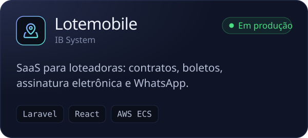
  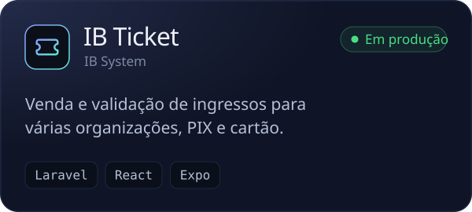

  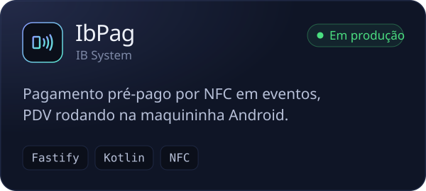
  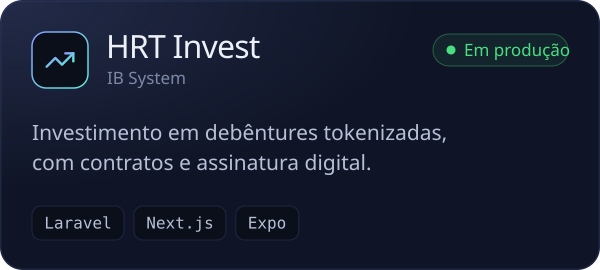

  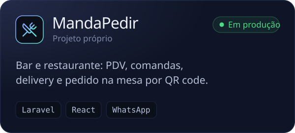
  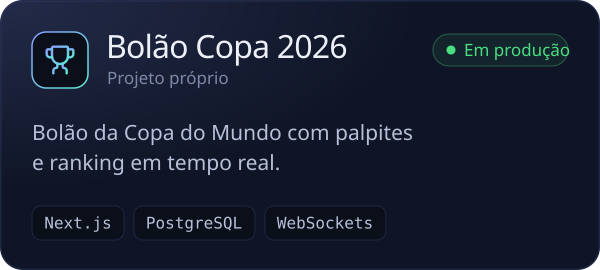

Em desenvolvimento: **HasGym**, gestão de academias com app para aluno e instrutor.

### Como trabalho

- **Multi-tenant desde o schema.** Isolamento entre clientes, cobrança e onboarding entram no desenho do banco, não depois.
- **Deploy pequeno e frequente.** CI/CD, logs e rollback prontos. Produção não é lugar de surpresa.
- **Negócio antes do código.** Entendo como o cliente vende e opera; a regra de negócio decide a arquitetura.

### Stack

- **Backend:** Laravel, PHP 8, Node.js, TypeScript, NestJS, Fastify, filas com Horizon e Redis
- **Frontend:** React, Next.js, Vite, Tailwind, PrimeReact
- **Mobile:** React Native com Expo, Kotlin com Jetpack Compose
- **Dados:** MariaDB, MySQL, PostgreSQL, Redis, MongoDB
- **Infra:** AWS (ECS, RDS, S3, CloudFront), Docker, Nginx, GitHub Actions
- **Integrações:** PIX, Mercado Pago, DocuSign, WhatsApp Cloud API, OpenAI, Claude

 

Senior full-stack engineer. Since 2018 I have designed, built and run multi-tenant SaaS that businesses rely on every day to sell, bill and operate, from the database schema to the AWS deploy.

I currently lead the products at **IB System** and maintain a few products of my own on the side.

### In production

  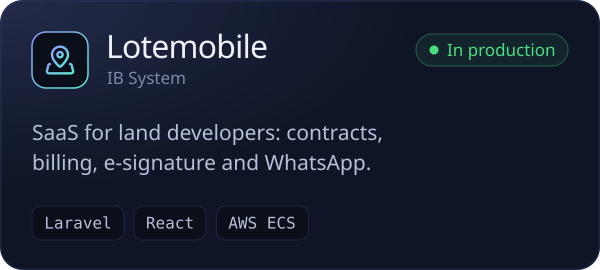
  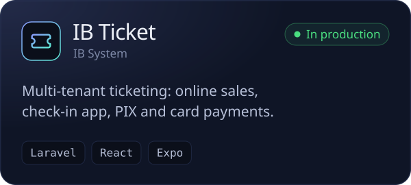

  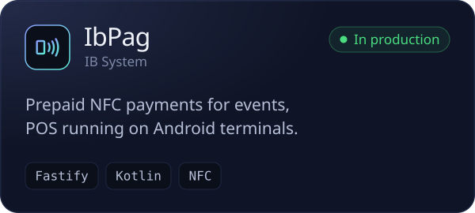
  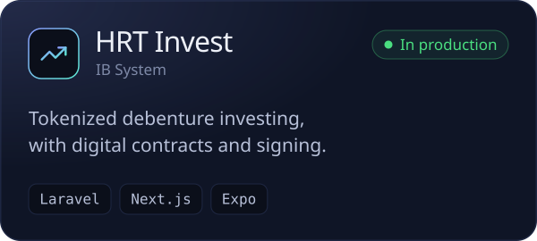

  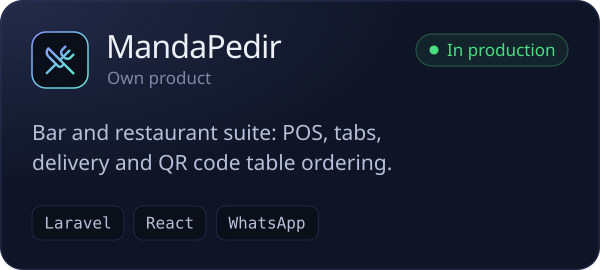
  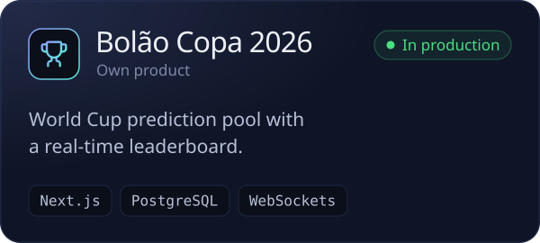

In development: **HasGym**, gym management with apps for members and trainers.

### How I work

- **Multi-tenant from the schema up.** Tenant isolation, billing and onboarding are part of the data model from day one.
- **Small, frequent deploys.** CI/CD, logs and rollback in place. Production is no place for surprises.
- **Business before code.** I learn how the client sells and operates; the business rules drive the architecture.

### Stack

- **Backend:** Laravel, PHP 8, Node.js, TypeScript, NestJS, Fastify, queues with Horizon and Redis
- **Frontend:** React, Next.js, Vite, Tailwind, PrimeReact
- **Mobile:** React Native with Expo, Kotlin with Jetpack Compose
- **Data:** MariaDB, MySQL, PostgreSQL, Redis, MongoDB
- **Infra:** AWS (ECS, RDS, S3, CloudFront), Docker, Nginx, GitHub Actions
- **Integrations:** PIX, Mercado Pago, DocuSign, WhatsApp Cloud API, OpenAI, Claude

 

  
  
  

